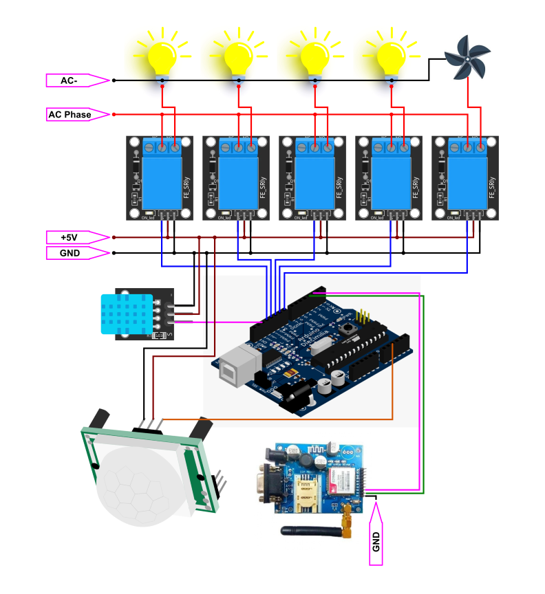

# 
GSM based IOT device programme

## Smart Portable Electric Board
An electric board which enables you to control your home appliances far from home. This is an IoT device to make home smarter.

## Features
- Easy to install
- SMS controlled fan, bulb, etc.
- Automatic fan speed controlling
- Motion controlled stair lights

## Technology Used
- Arduino Nano (A microcontroller)
- GSM Module (SIM900A)
- PIR (Motion Sensor)
- DHT11 (Temperature Sensor)

## Instruction To control appliances
- Send SMS to the inserted SIM in GSM module
- Use only the given commands (Mentioned in the file)

## Block Diagram

<!-- **Schematic** -->

<!--  -->
## Images

 

## Pin Description :
| Sl No. | Description     |     Pin       |
| :---   | :---            |     :---:     |
|1       | Rlay 1 (Bulb 1) |      4        |
|2       | Rlay 2 (Bulb 2) |      5        |
|3       | Rlay 3 (Bulb 3) |      6        |
|4       | Rlay 4 (fan 1 ) |      7        |
|5       | Rx(Arduino)     |      3        |
|6       | Tx(Arduino)     |      2        |
|7       | Temperature pin |      12       |
|9       | PIR Pin         |      A2       |
|1       | Mode 1          |      11       |
|1       | Mode 2          |      10       |
|1       | Mode 3          |      9        |
|1       | Mode 4          |      8        |

___Note:-___ Pin description will not change if you use Arduino uno

### Commands for various operations (Send SMS)
| Sl No. | Command     |     Description      |
| :---   | :---        |     :---:            |
|   1    | b1on        | Turn on bulb 1       |
|   2    | b1off       | Turn off bulb 1      |
|   3    | b2on        | Turn on bulb 2       |
|   4    | b2off       | Turn off bulb 2      |
|   5    | b3on        | Turn on bulb 3       |
|   6    | b3off       | Turn off bulb 3      |
|   7    | b4on        | Turn on bulb 4       |
|   8    | b4off       | Turn off bulb 4      |
|   9    | f1on        | Turn on fan  1       |
|   10   | f1off       | Turn off fan  1      |
|   11   | all on      | Turn on all appliance|
|   12   | all off     | Turn off all         |
|   13   | pir=on      | Activate PIR sensor  |
|   14   | pir=off     | Deactivate PIR sensor|